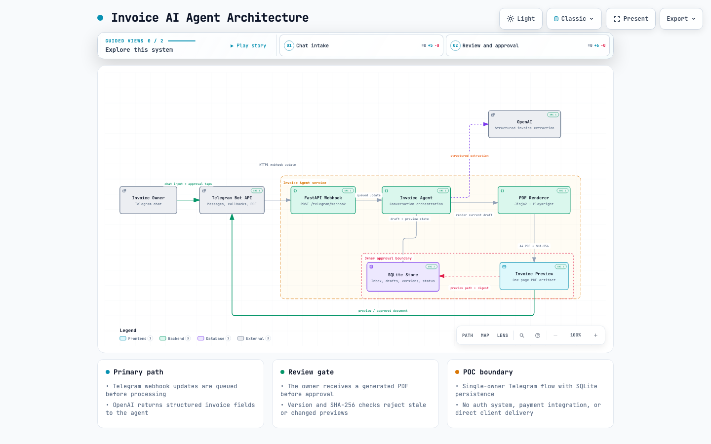
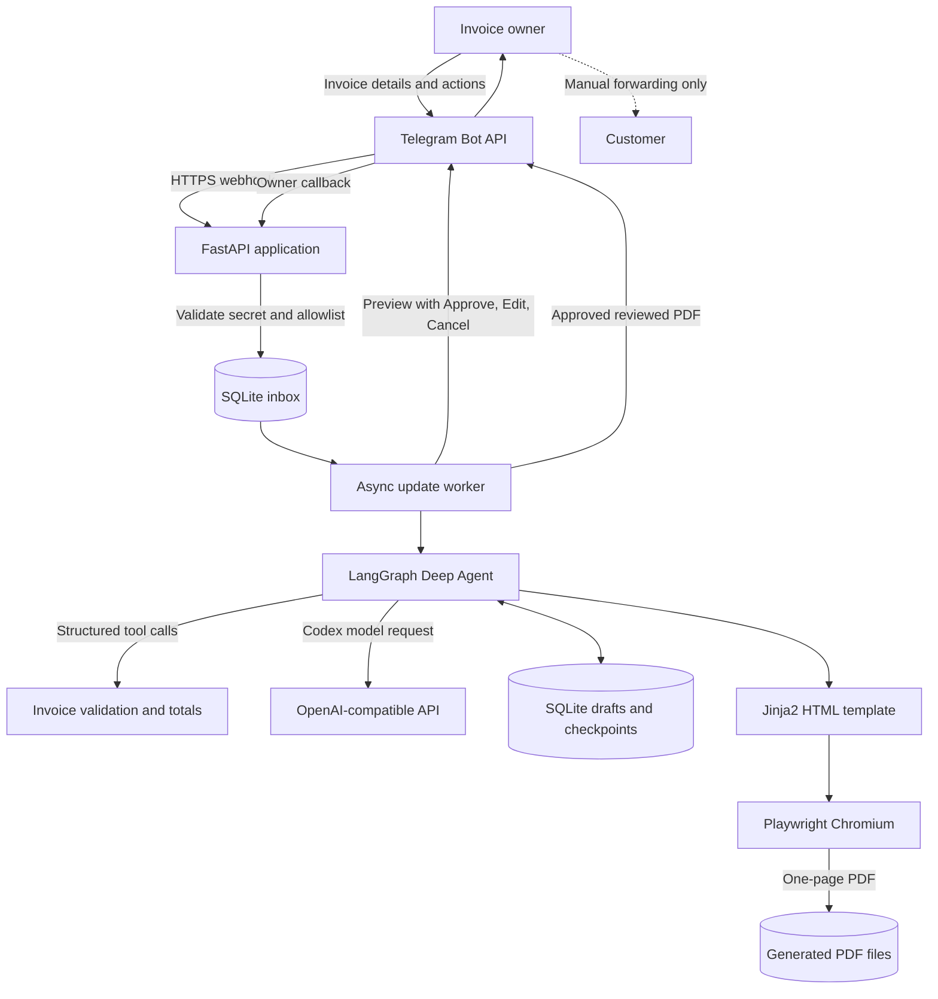

# Invoice AI Agent

Allowlisted Telegram bot that uses a LangGraph Deep Agent to collect invoice details, ask short clarifying questions, render the supplied template as a one-page PDF, and return the approved PDF to the originating chat.

The bot never contacts customers. You manually forward the approved PDF.

## Architecture

[](docs/diagrams/invoice-agent-architecture.html)

[Open the interactive architecture diagram](docs/diagrams/invoice-agent-architecture.html)



Telegram delivers messages and button callbacks to the FastAPI webhook. The webhook authenticates the request, filters non-allowlisted chats, persists each update, and returns quickly. A background worker processes the durable inbox, invokes the agent, stores versioned drafts, and renders a PDF only after validation succeeds. Approval is bound to the reviewed draft version and file digest; the bot returns that exact PDF to the owner, never directly to the customer.

## Tech Stack

- **Runtime:** Python 3.12 with asyncio
- **API:** FastAPI served by Uvicorn
- **Bot integration:** Telegram Bot API over HTTPS webhooks, called with HTTPX
- **LLM orchestration:** Deep Agents and LangGraph with LangChain OpenAI
- **Model:** configurable Codex model through an OpenAI-compatible Responses API endpoint
- **Validation and data modeling:** Pydantic 2, dataclasses, and `Decimal` money calculations
- **Persistence:** SQLite for the update inbox and invoice drafts; LangGraph SQLite checkpoints for conversation state
- **PDF generation:** Jinja2 HTML templating, Playwright with Chromium, and pypdf verification
- **Webhook tunnel:** Cloudflare Tunnel (cloudflared)
- **Quality:** pytest, pytest-asyncio, and Ruff

## Requirements

- Python 3.12
- A Telegram bot token from BotFather
- An OpenAI-compatible endpoint with access to the configured Codex model
- A Cloudflare account with your domain's nameservers on Cloudflare, for the tunnel

## Setup

```bash
python3.12 -m venv .venv
.venv/bin/pip install -e '.[test]'
.venv/bin/playwright install chromium
cp .env.example .env
```

Fill in `.env`. Set `TELEGRAM_ALLOWED_CHAT_IDS` to the comma-separated numeric chat IDs that may use the bot. Telegram authorization uses chat IDs, not phone numbers. You can obtain a chat ID by messaging the bot and inspecting a development webhook update or Telegram's `getUpdates` response before setting the production webhook.

Create the tunnel once, on the deployment host:

```bash
cloudflared tunnel login          # opens browser, pick your domain
cloudflared tunnel create invoice-agent
cloudflared tunnel route dns invoice-agent bot.emceecharrine.com
cloudflared tunnel token invoice-agent   # prints CLOUDFLARE_TUNNEL_TOKEN
```

Put the printed token in `.env` as `CLOUDFLARE_TUNNEL_TOKEN`.

## Run with Podman Compose

```bash
cd "/path/to/invoice 2"
set -a
source .env
set +a
podman-compose up -d
```

This starts the API and a `cloudflared` container that tunnels `bot.emceecharrine.com` straight to the `invoice-agent` service — no host port needs to be open.

Confirm the API is healthy:

```bash
podman exec invoice-agent-invoice-agent-1 curl -s http://127.0.0.1:8000/health
```

Expected response:

```json
{"status":"ok"}
```

Restart the compose stack after changing `.env`. The application reads environment variables only when it starts.
Set `LOG_LEVEL=DEBUG`, `INFO`, `WARNING`, or `ERROR` to change application log verbosity. The default is `INFO`.

### Register the Telegram webhook

```bash
cd "/path/to/invoice 2"
set -a
source .env
set +a

PUBLIC_BASE_URL="https://bot.emceecharrine.com"

curl -X POST "https://api.telegram.org/bot${TELEGRAM_BOT_TOKEN}/setWebhook" \
  -H 'Content-Type: application/json' \
  -d "{\"url\":\"${PUBLIC_BASE_URL}/telegram/webhook\",\"secret_token\":\"${TELEGRAM_WEBHOOK_SECRET}\",\"allowed_updates\":[\"message\",\"callback_query\"]}"
```

Verify the registration:

```bash
curl -s "https://api.telegram.org/bot${TELEGRAM_BOT_TOKEN}/getWebhookInfo" |
  python3 -m json.tool
```

The response should contain `bot.emceecharrine.com` and no `last_error_message`. Telegram sends the configured secret in `X-Telegram-Bot-Api-Secret-Token`. Updates from chats outside `TELEGRAM_ALLOWED_CHAT_IDS` are acknowledged and ignored.

The hostname is fixed once routed with `cloudflared tunnel route dns`, so the webhook only needs registering again if the domain or path changes.

## Troubleshooting

- No bot response and an empty `inbox` table: verify `getWebhookInfo` contains `bot.emceecharrine.com`, and that the `cloudflared` container is running (`podman logs -f <cloudflared-container>`).
- Telegram reaches the API but updates are ignored: confirm its numeric chat ID appears in `TELEGRAM_ALLOWED_CHAT_IDS`, then restart the compose stack.
- `429 FreeUsageLimitError`: the configured OpenAI-compatible provider has exhausted its quota or rate limit.

## Use

Send the bot any invoice details you already have, in English, Chinese, or both. It preserves supplied information and asks one missing-field question at a time. Prices, quantities, and customer details are never invented.

When the draft is complete, the bot sends a PDF with these actions:

- `Approve`: locks and returns the exact reviewed PDF.
- `Edit`: reopens the draft and invalidates the old approval button.
- `Cancel`: cancels the draft.

## Verify

```bash
.venv/bin/python -m pytest -q
.venv/bin/ruff check invoice_agent tests
.venv/bin/ruff format --check invoice_agent tests
.venv/bin/python -m compileall -q invoice_agent tests
```

## Architecture


Telegram delivers messages and button callbacks to the FastAPI webhook. The webhook authenticates the request, filters non-allowlisted chats, persists each update, and returns quickly. A background worker processes the durable inbox, invokes the agent, stores versioned drafts, and renders a PDF only after validation succeeds. Approval is bound to the reviewed draft version and file digest; the bot returns that exact PDF to the owner, never directly to the customer.

## Tech Stack

- **Runtime:** Python 3.12 with asyncio
- **API:** FastAPI served by Uvicorn
- **Bot integration:** Telegram Bot API over HTTPS webhooks, called with HTTPX
- **LLM orchestration:** Deep Agents and LangGraph with LangChain OpenAI
- **Model:** configurable Codex model through an OpenAI-compatible Responses API endpoint
- **Validation and data modeling:** Pydantic 2, dataclasses, and `Decimal` money calculations
- **Persistence:** SQLite for the update inbox and invoice drafts; LangGraph SQLite checkpoints for conversation state
- **PDF generation:** Jinja2 HTML templating, Playwright with Chromium, and pypdf verification
- **Webhook tunnel:** Cloudflare Tunnel (cloudflared)
- **Quality:** pytest, pytest-asyncio, and Ruff
