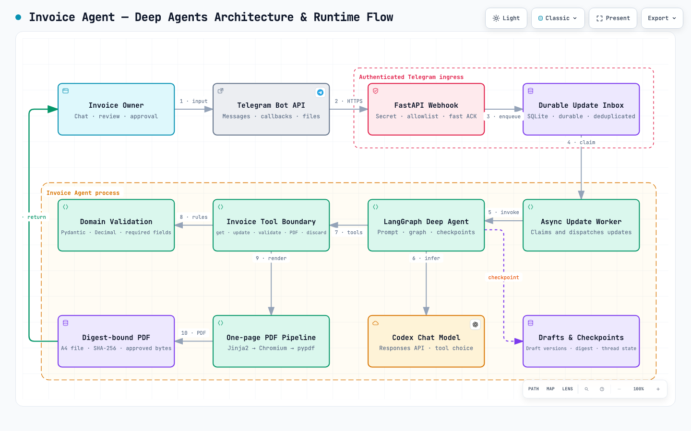

# Invoice AI Agent

Allowlisted Telegram bot that uses a LangGraph Deep Agent to collect invoice details, ask short clarifying questions, render the supplied template as a one-page PDF, and return the approved PDF to the originating chat.

The bot never contacts customers. You manually forward the approved PDF.

## Architecture

[](docs/diagrams/invoice-deep-agent-architecture.html)

[Open the interactive diagram](docs/diagrams/invoice-deep-agent-architecture.html) to switch themes, zoom, search, focus components, trace relationships, or export the view. The checked source specification is also available at [`docs/diagrams/invoice-deep-agent-architecture.json`](docs/diagrams/invoice-deep-agent-architecture.json).

### Runtime flow

1. The owner sends invoice facts or a button action through Telegram.
2. Telegram posts the update to `POST /telegram/webhook` with the webhook secret.
3. FastAPI compares the secret, checks the chat allowlist, deduplicates the Telegram `update_id`, writes the update to the SQLite inbox, wakes the worker, and returns immediately.
4. The async worker atomically claims the next queued update and dispatches a message or callback path. Failed updates remain retryable.
5. For a text message, `AgentService` invokes the LangGraph Deep Agent with the owner chat ID as the checkpoint `thread_id`.
6. The Deep Agent sends the system prompt, conversation messages, and tool schemas to the configured Codex model through `ChatOpenAI` and the Responses API.
7. The model can call only the invoice tools: `get_draft`, `update_draft`, `validate_draft`, `prepare_pdf`, and `discard_draft`. General-purpose subagents and filesystem, shell, task, search, and todo tools are disabled.
8. Tool inputs cross a Pydantic boundary. Domain code enforces required fields, allowed event values, one table-or-pax size, and `Decimal` money totals without trusting model prose.
9. The agent reads the current draft before mutation, validates after each update, then either asks one short missing-field question or calls `prepare_pdf`. Draft versions live in SQLite while conversation state is checkpointed by LangGraph.
10. A valid draft is rendered through Jinja2, Playwright Chromium, and pypdf. Rendering fails unless the result is exactly one A4 page; the saved preview records its SHA-256 digest and draft version.
11. Telegram returns the preview with `Approve`, `Edit`, and `Cancel`. Approval succeeds only when the chat, draft status, version, file path, and current file digest still match the reviewed preview. The exact bytes return to the owner for manual forwarding; the bot never contacts the customer.

### Deep Agent control loop

The system prompt defines the conversational policy: preserve supplied names, translate reception and service details to English, never invent facts or prices, use tools for every draft operation, and ask exactly one short clarifying question at a time. `ToolProgress` maps each structured call to a short Telegram status so the owner can see whether the agent is reading, updating, validating, generating, or cancelling.

The model decides which allowed tool to call, while deterministic application code owns state transitions, validation, totals, file generation, and approval. This keeps language understanding probabilistic but invoice and approval correctness enforceable.

## Tech Stack

- **Runtime:** Python 3.12 with asyncio
- **API:** FastAPI served by Uvicorn
- **Bot integration:** Telegram Bot API over HTTPS webhooks, called with HTTPX
- **LLM orchestration:** Deep Agents and LangGraph with LangChain OpenAI
- **Model:** configurable Codex model through an OpenAI-compatible Responses API endpoint
- **Validation and data modeling:** Pydantic 2, dataclasses, and `Decimal` money calculations
- **Persistence:** SQLite for the update inbox and invoice drafts; LangGraph SQLite checkpoints for conversation state
- **PDF generation:** Jinja2 HTML templating, Playwright with Chromium, and pypdf verification
- **Webhook tunnel:** Cloudflare Tunnel (cloudflared)
- **Quality:** pytest, pytest-asyncio, and Ruff

## Requirements

- Python 3.12
- A Telegram bot token from BotFather
- An OpenAI-compatible endpoint with access to the configured Codex model
- A Cloudflare account with your domain's nameservers on Cloudflare, for the tunnel

## Setup

```bash
python3.12 -m venv .venv
.venv/bin/pip install -e '.[test]'
.venv/bin/playwright install chromium
cp .env.example .env
```

Fill in `.env`. Set `TELEGRAM_ALLOWED_CHAT_IDS` to the comma-separated numeric chat IDs that may use the bot. Telegram authorization uses chat IDs, not phone numbers. You can obtain a chat ID by messaging the bot and inspecting a development webhook update or Telegram's `getUpdates` response before setting the production webhook.

Create the tunnel once, on the deployment host:

```bash
cloudflared tunnel login          # opens browser, pick your domain
cloudflared tunnel create invoice-agent
cloudflared tunnel route dns invoice-agent bot.emceecharrine.com
cloudflared tunnel token invoice-agent   # prints CLOUDFLARE_TUNNEL_TOKEN
```

Put the printed token in `.env` as `CLOUDFLARE_TUNNEL_TOKEN`.

## Run with Podman Compose

```bash
cd "/path/to/invoice 2"
set -a
source .env
set +a
podman-compose up -d
```

This starts the API and a `cloudflared` container that tunnels `bot.emceecharrine.com` straight to the `invoice-agent` service — no host port needs to be open.

Confirm the API is healthy:

```bash
podman exec invoice-agent-invoice-agent-1 curl -s http://127.0.0.1:8000/health
```

Expected response:

```json
{"status":"ok"}
```

Restart the compose stack after changing `.env`. The application reads environment variables only when it starts.
Set `LOG_LEVEL=DEBUG`, `INFO`, `WARNING`, or `ERROR` to change application log verbosity. The default is `INFO`.

### Register the Telegram webhook

```bash
cd "/path/to/invoice 2"
set -a
source .env
set +a

PUBLIC_BASE_URL="https://bot.emceecharrine.com"

curl -X POST "https://api.telegram.org/bot${TELEGRAM_BOT_TOKEN}/setWebhook" \
  -H 'Content-Type: application/json' \
  -d "{\"url\":\"${PUBLIC_BASE_URL}/telegram/webhook\",\"secret_token\":\"${TELEGRAM_WEBHOOK_SECRET}\",\"allowed_updates\":[\"message\",\"callback_query\"]}"
```

Verify the registration:

```bash
curl -s "https://api.telegram.org/bot${TELEGRAM_BOT_TOKEN}/getWebhookInfo" |
  python3 -m json.tool
```

The response should contain `bot.emceecharrine.com` and no `last_error_message`. Telegram sends the configured secret in `X-Telegram-Bot-Api-Secret-Token`. Updates from chats outside `TELEGRAM_ALLOWED_CHAT_IDS` are acknowledged and ignored.

The hostname is fixed once routed with `cloudflared tunnel route dns`, so the webhook only needs registering again if the domain or path changes.

## Troubleshooting

- No bot response and an empty `inbox` table: verify `getWebhookInfo` contains `bot.emceecharrine.com`, and that the `cloudflared` container is running (`podman logs -f <cloudflared-container>`).
- Telegram reaches the API but updates are ignored: confirm its numeric chat ID appears in `TELEGRAM_ALLOWED_CHAT_IDS`, then restart the compose stack.
- `429 FreeUsageLimitError`: the configured OpenAI-compatible provider has exhausted its quota or rate limit.

## Use

Send the bot any invoice details you already have, in English, Chinese, or both. It preserves supplied information and asks one missing-field question at a time. Prices, quantities, and customer details are never invented.

When the draft is complete, the bot sends a PDF with these actions:

- `Approve`: locks and returns the exact reviewed PDF.
- `Edit`: reopens the draft and invalidates the old approval button.
- `Cancel`: cancels the draft.

## Verify

```bash
.venv/bin/python -m pytest -q
.venv/bin/ruff check invoice_agent tests
.venv/bin/ruff format --check invoice_agent tests
.venv/bin/python -m compileall -q invoice_agent tests
```
