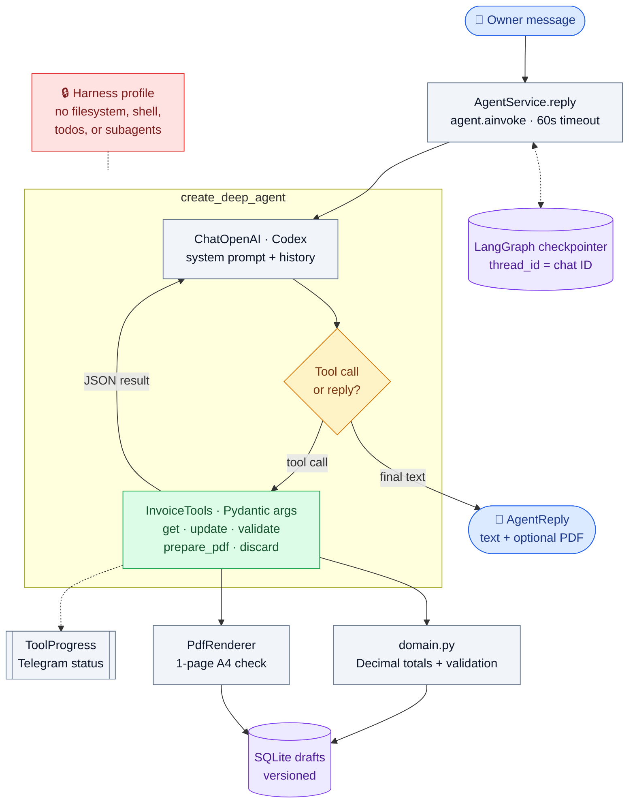

### Deep Agent control loop

```mermaid
flowchart TB
    msg([💬 Owner message])
    invoke[AgentService.reply<br/>agent.ainvoke · 60s timeout]
    ckpt[(LangGraph checkpointer<br/>thread_id = chat ID)]

    subgraph DA["create_deep_agent"]
        direction TB
        llm[ChatOpenAI · Codex<br/>system prompt + history]
        decide{Tool call<br/>or reply?}
        tools[InvoiceTools · Pydantic args<br/>get · update · validate<br/>prepare_pdf · discard]
        llm --> decide
        decide -- tool call --> tools
        tools -- JSON result --> llm
    end

    guard[🔒 Harness profile<br/>no filesystem, shell,<br/>todos, or subagents]
    progress[[ToolProgress<br/>Telegram status]]
    domain[domain.py<br/>Decimal totals + validation]
    store[(SQLite drafts<br/>versioned)]
    render[PdfRenderer<br/>1-page A4 check]
    reply([📨 AgentReply<br/>text + optional PDF])

    msg --> invoke --> llm
    invoke <-.-> ckpt
    guard -.- DA
    tools -.-> progress
    tools --> domain --> store
    tools --> render --> store
    decide -- final text --> reply

    classDef io fill:#dbeafe,stroke:#2563eb,color:#1e3a8a
    classDef step fill:#f1f5f9,stroke:#64748b,color:#0f172a
    classDef decideC fill:#fef3c7,stroke:#d97706,color:#78350f
    classDef storeC fill:#ede9fe,stroke:#7c3aed,color:#4c1d95
    classDef bad fill:#fee2e2,stroke:#dc2626,color:#7f1d1d
    classDef tool fill:#dcfce7,stroke:#16a34a,color:#14532d

    class msg,reply io
    class invoke,llm,domain,render,progress step
    class decide decideC
    class ckpt,store storeC
    class guard bad
    class tools tool
```
